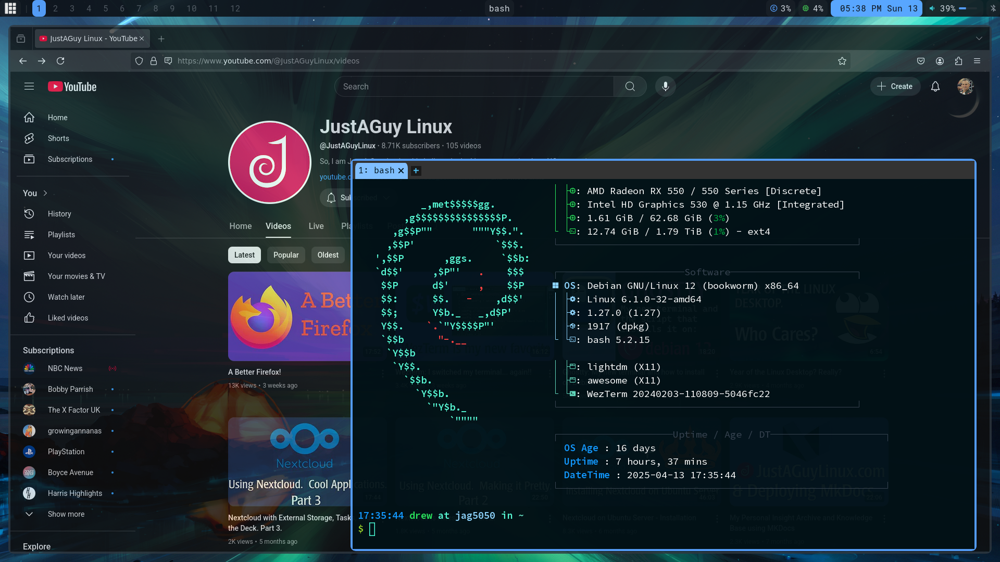

# 🪄 AwesomeWM Modular Configuration

> **🚨 REPOSITORY MIGRATION NOTICE**
>
> This repository has moved to **[Codeberg](https://codeberg.org/justaguylinux/awesomewm-setup)**
>
> - **Primary repository**: https://codeberg.org/justaguylinux/awesomewm-setup
> - **This GitHub repository**: Mirror only (read-only)
> - **Migration deadline**: December 15, 2025 - GitHub mirror will be archived
>
> Please update your bookmarks and git remotes:
> ```bash
> git remote set-url origin https://codeberg.org/justaguylinux/awesomewm-setup.git
> ```


A modular, organized AwesomeWM configuration with clean separation of components.
Features GitHub-themed styling, smart keybindings, and a comprehensive widget system — ready to use out of the box.




---

## 🚀 Installation

### Quick Install
```bash
git clone https://codeberg.org/justaguylinux/awesomewm-setup.git
cd awesomewm-setup
chmod +x install.sh
./install.sh
```

### Installation Options

The installer now supports various options for different use cases:

```bash
./install.sh [OPTIONS]

Options:
  --only-config       Only copy config files (perfect for non-Debian distros)
  --skip-packages     Skip apt package installation
  --skip-themes       Skip theme, icon, and font installations
  --skip-butterscripts Skip all external script installations
  --dry-run          Show what would be done without making changes
  --help             Show usage information
```

### Distribution-Agnostic Installation

<details>
<summary><strong>⚠️ UNSUPPORTED: Instructions for other distributions (click to expand)</strong></summary>

**IMPORTANT:** These instructions are provided as-is for advanced users. Non-Debian distributions are **NOT officially supported**. Package names and availability may vary. Use at your own risk.

**Arch Linux:**
```bash
# Install dependencies (package names may differ)
sudo pacman -S awesome rofi dunst picom thunar xorg-xbacklight \
  pamixer pavucontrol feh redshift flameshot firefox \
  network-manager-applet xfce4-power-manager ttf-font-awesome

# Copy configuration files
./install.sh --only-config
```

**Fedora:**
```bash
# Install dependencies (package names may differ)
sudo dnf install awesome rofi dunst picom thunar xbacklight \
  pamixer pavucontrol feh redshift flameshot firefox \
  network-manager-applet xfce4-power-manager fontawesome-fonts

# Copy configuration files
./install.sh --only-config
```

**openSUSE:**
```bash
# Install dependencies (package names may differ)
sudo zypper install awesome rofi dunst picom thunar xbacklight \
  pamixer pavucontrol feh redshift flameshot firefox \
  NetworkManager-applet xfce4-power-manager fontawesome-fonts

# Copy configuration files
./install.sh --only-config
```

</details>

### Advanced Usage Examples

```bash
# Preview what will be installed
./install.sh --dry-run

# Update only configuration files
./install.sh --only-config

# Skip package installation if already installed
./install.sh --skip-packages

# Install without themes and fonts
./install.sh --skip-themes
```

**Note:** The script can be run from any location - it automatically detects its directory.

### Testing Configuration
```bash
# Test AwesomeWM configuration syntax before applying
awesome -k ~/.config/awesome/rc.lua

# Restart AwesomeWM (from within AwesomeWM session)
awesome.restart()
```

---

## 📦 Module Overview

| Module | Purpose |
|--------|---------|
| `autostart.lua` | Application autostart management |
| `error_handling.lua` | Error capture and notifications |
| `keybindings.lua` | Keyboard shortcuts configuration |
| `layouts.lua` | Window layout algorithms |
| `libraries.lua` | Core and optional dependencies |
| `menu.lua` | Application menu and launcher |
| `mousebindings.lua` | Mouse controls and behaviors |
| `notifications.lua` | GitHub-themed notification system |
| `rules.lua` | Window behavior and appearance rules |
| `scratchpad.lua` | Scratchpad terminal functionality |
| `screens.lua` | Multi-monitor and wallpaper handling |
| `signals.lua` | Event response configuration |
| `theme.lua` | Visual theming loader |
| `variables.lua` | Global settings and defaults |
| `wibar.lua` | Top panel configuration |
| `widgets.lua` | System monitoring and UI elements |

---

## 🔑 Key Features

### Autostart System
- Detects or creates `~/.config/awesome/scripts/autorun.sh`
- Auto-generates template if not found
- Persists across AwesomeWM restarts

### Error Management
- Captures startup and runtime errors
- Displays user-friendly notifications
- Prevents silent crashes

### Advanced Keybindings
- Window management (move, resize, close)
- Tag navigation (view, move, follow)
- Application launching shortcuts
- Media controls (volume, brightness)
- Screenshot capabilities
- Scratchpad terminals (Super+Shift+Return for terminal, and more)

### GitHub-Themed Notifications
- Rounded corners with GitHub color scheme
- Different styles for urgency levels
- Custom icon path integration

### Multi-Screen Support
- Per-screen tag tables
- Intelligent wallpaper handling
- Screen-specific layouts

### Modern Widget System
- CPU & memory monitoring
- Volume control with scrolling
- Window title display
- Bluetooth status indicator
- Clock with date integration

---

## 🎨 Layouts Available

The following layouts are included:

- **Tile** - Master and stacking clients (default)
- **Tile Left** - Master on right, stacking left
- **Fair** - Equal area distribution
- **Fair Horizontal** - Equal horizontal distribution
- **Spiral** - Fibonacci spiral layout

---

## 🔧 Configuration Files

```
~/.config/awesome/
├── rc.lua                   # Main configuration entry point
├── modules/
│   ├── autostart.lua        # Application autostart
│   ├── error_handling.lua   # Error notifications
│   ├── keybindings.lua      # Keyboard shortcuts
│   ├── layouts.lua          # Window layouts
│   ├── libraries.lua        # Core dependencies
│   ├── menu.lua             # Application menu
│   ├── mousebindings.lua    # Mouse controls
│   ├── notifications.lua    # GitHub-themed notifications
│   ├── rules.lua            # Window behaviors
│   ├── scratchpad.lua       # Scratchpad terminal
│   ├── screens.lua          # Multi-monitor support
│   ├── signals.lua          # Event handling
│   ├── theme.lua            # Theme loader
│   ├── variables.lua        # Global settings
│   ├── wibar.lua            # Top panel
│   └── widgets.lua          # System monitoring
├── themes/
│   └── default/
│       └── theme.lua        # Visual theme settings
├── scripts/
│   └── autorun.sh          # Startup applications
├── dunst/
│   └── dunstrc             # Notification daemon config
├── rofi/
│   ├── config.rasi         # Rofi launcher config
│   └── power.rasi          # Power menu theme
└── picom/
    └── picom.conf          # Compositor configuration
```

---

## 📋 Module Details

<details>
<summary>Click to expand module descriptions</summary>

### 🚀 autostart.lua
**What it does:**  
Manages automatic startup of applications when AwesomeWM launches.

**Key features:**
- Looks for an `autorun.sh` script in the scripts directory
- Creates a template script if not found
- Executes the script on startup
- Supports direct application launches

---

### ⚠️ error_handling.lua
**What it does:**  
Captures and displays errors to prevent silent failures.

**Key features:**
- Handles startup errors with clear notifications
- Captures runtime errors without endless loops
- Uses critical notification presets

---

### ⌨️ keybindings.lua
**What it does:**  
Defines all keyboard shortcuts for window and system control.

**Key features:**
- Window management (close, fullscreen, floating)
- Tag navigation (1-12 with Super+number)
- Layout manipulation (resize, reorder)
- Application launching shortcuts
- Screenshot controls
- Volume management
- Redshift (blue light) toggle

---

### 🪟 layouts.lua
**What it does:**  
Configures available layout algorithms for organizing windows.

**Key features:**
- Tile (master and stacking)
- Tile left (reversed)
- Fair (equal area)
- Spiral layout
- Sets the default layout

---

### 📚 libraries.lua
**What it does:**  
Loads and initializes all required libraries.

**Key features:**
- Core library loading
- LuaRocks integration
- Optional libraries (Debian menu, freedesktop)
- Global library references

---

### 📋 menu.lua
**What it does:**  
Creates the application menu and launcher widget.

**Key features:**
- Awesome controls submenu
- Application categories
- Terminal launcher
- Icon-based launcher widget

---

### 🖱️ mousebindings.lua
**What it does:**  
Defines mouse-based controls for window management.

**Key features:**
- Right-click menu access
- Tag switching with scroll wheel
- Window movement with Super+drag
- Window resizing with Super+right-drag

---

### 🔔 notifications.lua
**What it does:**  
Customizes the notification system with GitHub theming.

**Key features:**
- GitHub-based color scheme
- Rounded corners with custom radius
- Different urgency presets
- Icon directory configuration
- Timeout settings

---

### 📏 rules.lua
**What it does:**  
Sets rules for how different windows behave when created.

**Key features:**
- Default window properties
- Floating window specifications
- Application-specific sizing
- Titlebar controls
- Tag assignments for specific applications

---

### 🗂️ scratchpad.lua
**What it does:**  
Provides dropdown terminals and applications that can be toggled with keyboard shortcuts.

**Key features:**
- Multiple scratchpad applications:
  - Terminal: Super+Shift+Return
  - File manager (ranger): Super+Shift+F
  - Volume mixer: Super+Shift+V
  - Music player: Super+Shift+M
  - Audio control: Super+Shift+P
- Animated slide-down effect
- Maintains state across toggles
- Positioned at top of screen
- Takes 90% width, 50% height

---

### 🖥️ screens.lua
**What it does:**  
Manages multi-monitor configuration and wallpapers.

**Key features:**
- Per-screen tag tables
- Wallpaper handling
- Screen-specific layouts
- Geometry change response

---

### 📡 signals.lua
**What it does:**  
Configures how AwesomeWM responds to various events.

**Key features:**
- New client appearance handling
- Titlebar setup for appropriate windows
- Focus behavior (focus follows mouse)
- Border color changes on focus
- Screen and tag signal responses

---

### 🎨 theme.lua
**What it does:**  
Loads visual theming for the entire window manager.

**Key features:**
- Looks for custom theme in config directory
- Falls back to default if not found
- Outputs debug information

---

### ⚙️ variables.lua
**What it does:**  
Defines global settings used throughout the configuration.

**Key features:**
- Default applications
- Modifier key setting
- Path definitions
- Theme settings
- Tag names (workspaces)
- Media control commands

---

### 📊 wibar.lua
**What it does:**  
Creates and configures the top panel with widgets.

**Key features:**
- Position and height settings
- Opacity configuration
- Widget organization (left, center, right)
- Screen-specific wibars

---

### 📈 widgets.lua
**What it does:**  
Provides monitoring and UI elements for the panel.

**Key features:**
- CPU and memory usage
- Volume control with scroll adjustment
- Clock with date
- Bluetooth status indicator
- Window title display
- Systray integration
- Tag list with visual indicators

</details>

---

## 📑 Usage Example

To use these modules in your `rc.lua`:

```lua
-- Load libraries
require("modules.libraries")

-- Load variables
local variables = require("modules.variables")

-- Initialize modules (order matters)
local error_handling = require("modules.error_handling")
error_handling.init()

local theme = require("modules.theme")
theme.init()

local screens = require("modules.screens")
screens.init()

local keybindings = require("modules.keybindings")
keybindings.init()

local mousebindings = require("modules.mousebindings")
mousebindings.init()

local rules = require("modules.rules")
rules.init()

local signals = require("modules.signals")
signals.init()

local widgets = require("modules.widgets")
widgets.init()

local wibar = require("modules.wibar")
wibar.init()

local menu = require("modules.menu")
menu.init()

local layouts = require("modules.layouts")
layouts.init()

local autostart = require("modules.autostart")
autostart.init()

local scratchpad = require("modules.scratchpad")
scratchpad.init()
```

---

## 🔧 Customization

The most common customizations:

- **keybindings.lua**: Change keyboard shortcuts
- **variables.lua**: Set preferred applications
- **theme.lua**: Adjust colors and appearance
- **autostart.lua**: Manage startup programs
- **widgets.lua**: Add/remove system monitors
- **rules.lua**: Change how specific apps behave

## 📺 Watch on YouTube

Want to see how it looks and works?
🎥 Check out [JustAGuy Linux on YouTube](https://www.youtube.com/@JustAGuyLinux)

---

<a href="https://www.buymeacoffee.com/justaguylinux" target="_blank"></a>

